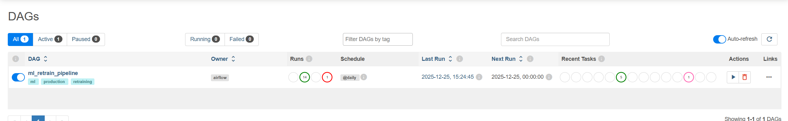
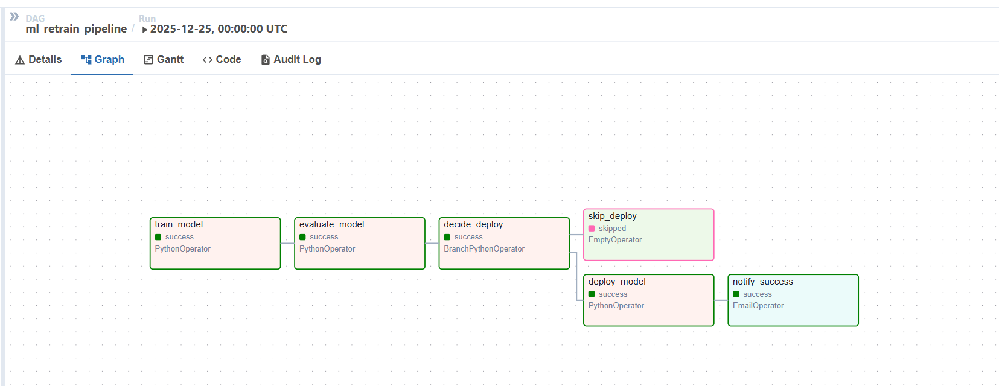
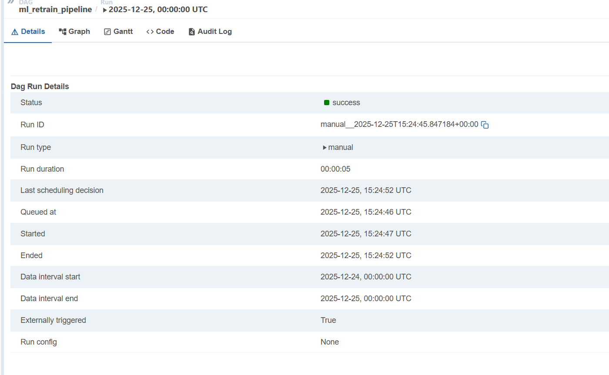
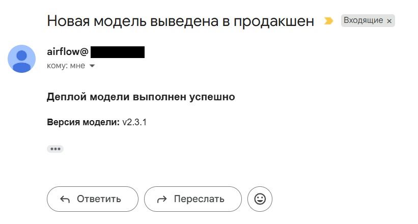

# Домашнее задание 5. Модификация DAG в Airflow для уведомлений о выводе новой модели в продакшен

## Описание пайплайна

DAG `ml_retrain_pipeline` включает следующие этапы:

1. **train_model** — обучение модели
2. **evaluate_model** — оценка качества модели
3. **decide_deploy** — ветвление на основе метрики качества
4. **deploy_model** — деплой модели в продакшен 
5. **notify_success** — email-уведомление о успешном деплое

Деплой выполняется только при удовлетворительных метриках.

---

## Условие деплоя

В DAG используется `BranchPythonOperator`.

Если значение метрики >= порогового значения (`METRIC_THRESHOLD`), выполняется деплой модели.  
В противном случае деплой пропускается.

---

## Уведомления

После успешного деплоя отправляется email-уведомление с информацией о версии модели.

Для отправки используется `EmailOperator` и SMTP-сервер, настраиваемый через переменные окружения.

---

## Конфигурация через переменные окружения

Конфигурация отделена от кода DAG и передаётся через `.env` файл:

- `MODEL_VERSION` — версия модели, отображаемая в уведомлении
- `NOTIFY_EMAIL` — email получателя уведомлений
- `SMTP_*` — параметры SMTP-сервера

Пример файла `.env.example`:

```env
MODEL_VERSION=v1.0.1
NOTIFY_EMAIL=send_to@domain.com

SMTP_HOST=mail.domain.com
SMTP_PORT=587
SMTP_USER=airflow@domain.com
SMTP_PASSWORD=PASS
SMTP_MAIL_FROM=airflow@domain.com
```

## Запуск проекта

### 1. Клонировать репозиторий
```bash
git clone https://github.com/naikin49/airflow_ml.git
cd airflow-ml
```

### 2. Создать `.env` файл
```bash
cp .env.example .env
```

Заполнить значения переменных.

### 3. Запустить Airflow

```bash
docker compose up -d
```

### 4. Открыть Airflow UI

```bash
http://localhost:8080
```
Логин/пароль (если используется стандартная конфигурация): `admin / admin`


## Структура проекта

```
airflow-ml/
├── dags/
│   └── ml_retrain_pipeline.py
├── docker-compose.yml
├── .env.example
├── README.md
├── .gitignore
└── img/
```

## Скриншоты работы пайплайна
В данном разделе представлены скриншоты, подтверждающие корректную работу DAG и выполнение всех требований задания.

### 1. Список DAG в Airflow UI
Отображается DAG ml_retrain_pipeline, доступный для запуска и успешно выполнявшийся.


### 2. Граф выполнения DAG (Graph View)
Показана структура DAG и последовательность выполнения задач:
- обучение модели
- оценка качества
- условный деплой
- отправка email-уведомления



Задача `notify_success` выполняется только после успешного деплоя.

### 3. Детали успешного запуска DAG
Отображается информация о запуске DAG со статусом `success`. 



### 4. Audit Log выполнения задач


Подтверждается последовательное выполнение задач, включая `deploy_model` и `notify_success`.

### 5. Email-уведомление о деплое модели
Пример письма, отправленного после успешного деплоя модели в продакшен с указанием версии модели.




## Результат

DAG успешно выполняется, условный деплой работает корректно, уведомление отправляется только при успешном выводе модели в продакшен.

